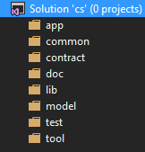
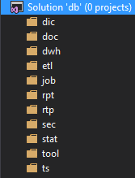

Типовая структура решений
=========================

В больших решениях важно поддержать структуру проектов.

Хорошая декомпозиция обеспечивает

-   быстрый поиск компоненты

-   понимание архитектуры системы

Структура решений C\#
---------------------

Предлагаемая структура выглядит следующим образом

-   App - Приложения

-   Common - Общие сборки

-   Contract - Интерфейсы взаимодействия

-   Doc - Документы

-   Lib - Специфичные сборки

-   Model - Структуры данных, бизнес правила и процессы

-   Test - Тесты

-   Tool - Инструменты

Структура решений DB
--------------------

Предлагаемая структура выглядит следующим образом

-   Dic – Нормативно-справочная информация

-   Doc - Документы

-   Dwh - Хранилища

-   Etl – Извлечение-Трансформация-Загрузка

-   Job - Задачи

-   Rpt - Отчеты

-   Rtp – Обработка реального времени

-   Sec - Безопасность

-   Stat - Статистика

-   Tool – Инструменты

-   Ts – Транспорт данных

Файлы
-----

### cs

### db

Литература
==========