Ветки разработки
================

С использованием веток мы можем достигнуть следующих целей:

-   Управление параллельной работой нескольких команд на одной кодовой
    базе.

-   Изолирование рисков, которые вводятся различными наборами изменений
    в кодовую базу

-   Создание снимков и последующая поддержка изолированных изменений.

Структура папок
---------------

В больших проектах важно поддержать структуру папок для веток.
Предлагаемая структура выглядит следующим образом:

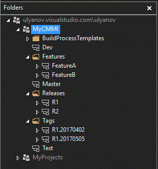

-   **BuildProcessTemplates** – Содержит решения для автоматический
    сборки и развертывания

-   **Dev** – Ветка, где ведется основная разработка

-   **Features** – Содержит ветки для разработки отдельных функций

-   **Master** – Главная ветка.

-   **Releases** – Содержит ветки для релизов

-   **Tags** – Содержит снимки веток.

-   **Test** – Ветка тестирования

Структура веток
---------------

Предлагаемая структура наследования веток выглядит следующим образом

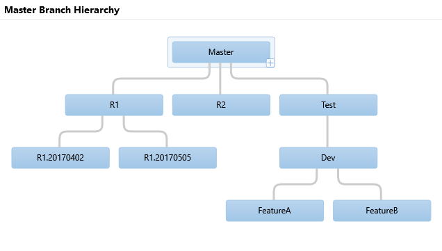

### Время жизни веток

Описание процессов
------------------

Ниже представлена диаграмма активностей

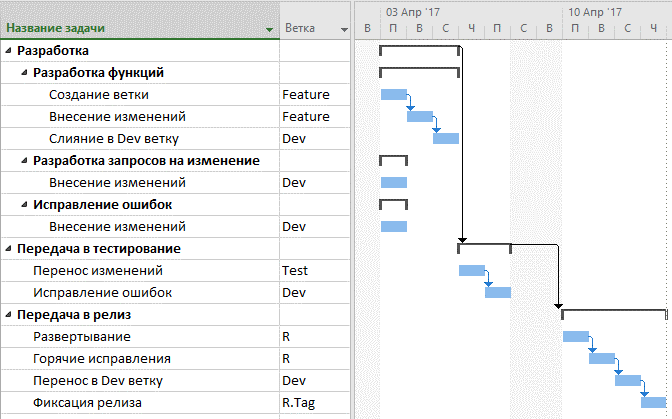

### Разработка функций

Состоит из следующих этапов.

1.  Создание ветки под функцию. Родитель: Dev, Папка: Features

2.  Внесение изменений

3.  Исполнение модульных тестов

4.  Изменения проталкиваются в Dev ветку

5.  Решение конфликтов слияния

6.  Исполнение модульных и интеграционных тестов

7.  Передача в тестирование

Периодически возможен процесс проталкивания изменений из Dev ветки с
последующим решением конфликтов.

### Разработка запросов на изменение

Состоит из следующих этапов

1.  Внесение изменений в Dev ветку

2.  Исполнение модульных и интеграционных тестов

3.  Передача в тестирование

### Исправление ошибок

Состоит из следующих этапов

1.  Внесение изменений в Dev ветку

2.  Исполнение модульных и интеграционных тестов

3.  Передача в тестирование (test)

### Передача в тестирование

Состоит из следующих этапов

1.  Проталкивание изменения из Dev ветки в Test (merge)

2.  Формирование отчета (feature list, release notes)

3.  Сбор результатов тестирования (feedback)

4.  Исправление ошибок (fix)

### Передача в релиз

Состоит следующих этапов

1.  Проталкивание изменений из Test в Master

2.  Создание релизной ветки. Родитель: Master, Папка: Releases

3.  Исполнение смоук тестов

4.  Развертывание в проде

5.  Внесение хотфкисов

6.  Тегируем релизную ветку

7.  Проталкиваем изменения в Dev ветку. (R-&gt;Master-&gt;Test-&gt;Dev)

Движение изменений (tracking changeset)
---------------------------------------

Далее представлены диаграммы движения изменений в ветках

### Разработка функций:

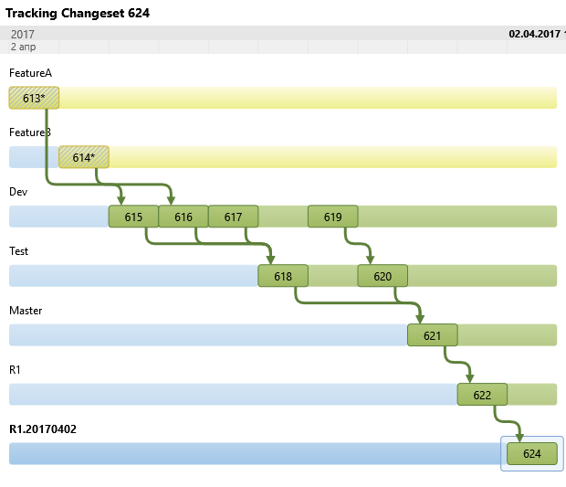

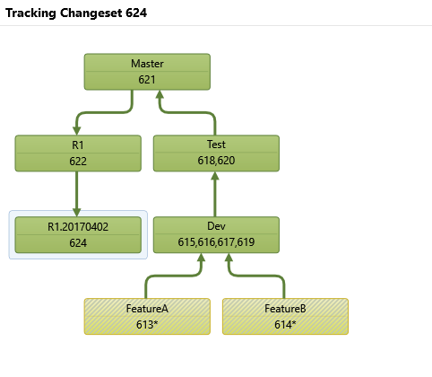

-   613 (FeatureA) – разработка функции A

-   614 (FeatureB) – разработка функции B

-   615 (Dev) – слияние изменений FeatureA -&gt; Dev

-   616 (Dev) – слияние изменений FeatureB-&gt;Dev

-   617 (Dev) – решение конфликтов слияний A и B

-   618 (Test) – передача в тестирование A и B

-   619 (Dev) – исправления ошибок

-   620 (Test) – передача в тестирование исправлений

-   621 (Master) – фиксация в главной ветке

-   622 (R1) – передача в релиз

-   624 (R1.20170402) – снимок после развертывания

### Разработка запросов на изменение:

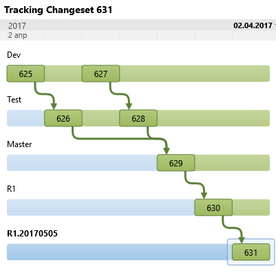

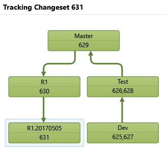

-   625 (Dev) - разработка запроса на изменение

-   626 (Test) – передача в тестирование запроса на изменение

-   627 (Dev) – исправления ошибок

-   628 (Test) – передача в тестирование исправлений

-   629 (Master) – фиксация в главной ветке

-   630 (R1) – передача в релиз

-   631 (R1.20170505) – снимок после развертывания

### Исправление ошибок

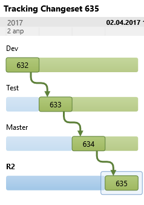

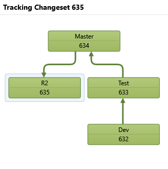

-   632 (Dev) – исправление

-   633 (Test) – передача в тестирование

-   624 (Master) – фиксация в главной ветке

-   625 (R2) – передача в релиз

### Горячие исправления

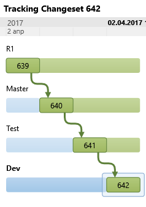

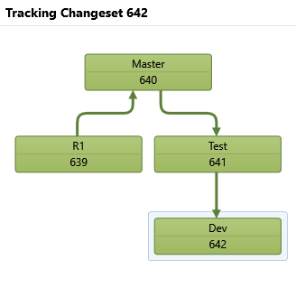

-   639 (R1) – внесение горячего исправления

-   640 (Master) – фиксация в главной ветке

-   641 (Test) – передача в тестирование

-   642 (Dev) – фиксация в Dev ветке

Литература
==========
